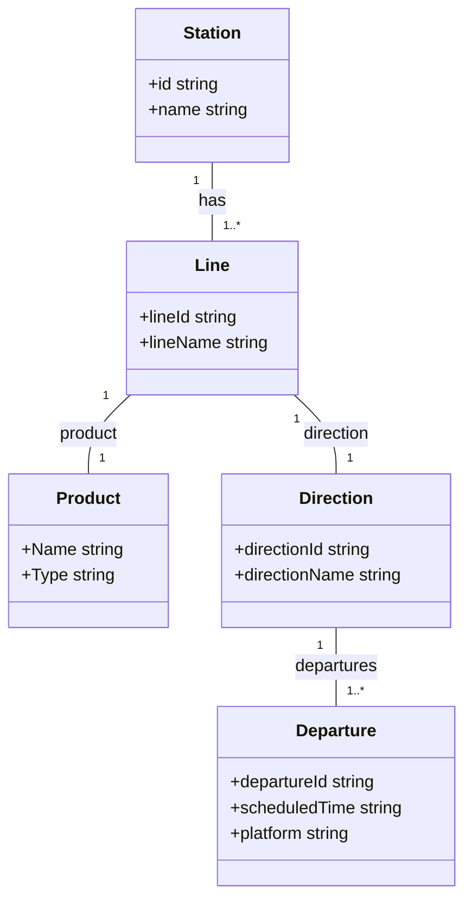
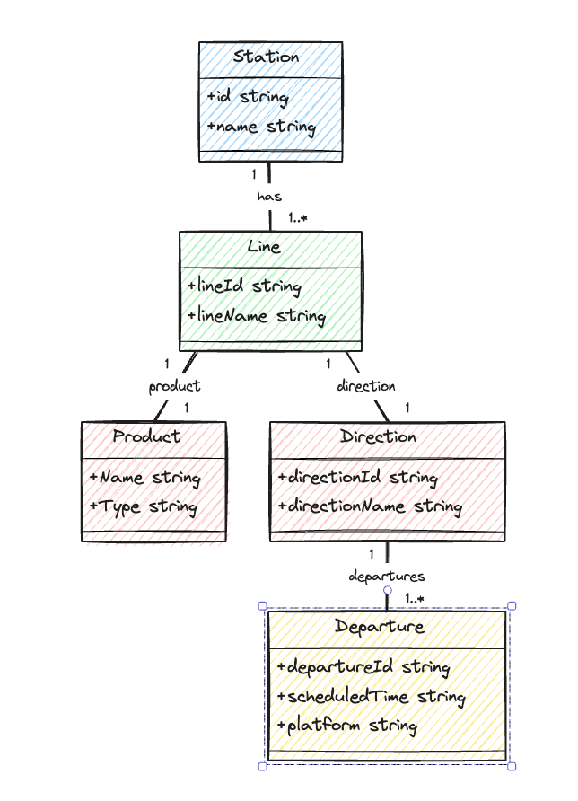

# Berlin Station Board

--------------------

### Backend High-Level Design

### Using singleflight to Prevent Duplicate Calls
The singleflight package ensures that if multiple goroutines make the same request (in this case, refreshing the cache for departure times), only one request will actually go through to the API. The others will wait for the first request to complete and receive the same response. This is particularly useful during high traffic periods or when the cache for a popular station expires and needs refreshing.

### Backend Caching Mechanism:
The backend will maintain a cache of departure times.
Cache entries will have a TTL (Time To Live) calculated as departure time - time.Now().
When a cache entry expires (is evicted due to TTL), the next request for that station will trigger an API call to refresh the cache.

### Adaptive TTL Adjustments
Adaptively adjust TTLs based on the time of day or specific departure characteristics. For instance, during peak hours when departures are more frequent and potentially more volatile, use shorter TTLs. For late-night hours with less frequent changes, longer TTLs could be more appropriate.
1. Define Criteria for TTL Variation
   Start by identifying the criteria that will influence the TTL settings. For a station board application, consider:
    - Time of Day: Peak hours might need shorter TTL due to higher frequency of changes and user queries.
        - 7AM to 9AM - 5PM to 7PM
        - Weekends
        - holidays
    - Departure Time Proximity: Departures closer in time might need fresher data than those further away.

```go
package main

func dynamicCachePeriod(multiplier, base, fallback float64, when time.Time, now time.Time) int64 {
    secs := when.Sub(now).Seconds()
    weekday := now.Weekday()

	// Adjust multiplier for weekends
	if weekday == time.Saturday || weekday == time.Sunday {
		multiplier *= 1.2 // Example adjustment for weekends
	}

	// Adjust multiplier based on the time of day
	hourOfDay := now.Hour()
	if hourOfDay >= 7 && hourOfDay <= 10 { // Morning peak hours
		multiplier *= 1.1
	} else if hourOfDay >= 17 && hourOfDay <= 19 { // Evening peak hours
		multiplier *= 1.1
	}

	if secs > 0 {
		return int64(math.Round(
			multiplier *
				math.Max(base, math.Pow(secs, 0.5)) *
				float64(time.Second),
		))
	}
	return int64(math.Round(multiplier * fallback * float64(time.Second)))
}
```

### User Experience During Data Refresh: // TODO
Users might see slightly outdated information if they request data right before a refresh.
Solution: Communicate clearly to users that data is being updated or show a countdown to the next refresh.

--------------------
## FrontEnd
### User Notifications: 
If the departure information changes (e.g., a delay or cancellation), consider how these updates are communicated to users, especially those who may have already checked the departure time.

### Adaptive Polling: 
Dynamically adjust the polling frequency based on user activity or time to departure. For example, increase the polling interval when a departure is further away and decrease it as the departure time approaches.

### Use Efficient HTTP Requests: 
Ensure that your polling requests are as lightweight as possible. For example, you could use HTTP GET requests that return only the necessary data. Consider using HTTP headers like If-Modified-Since to avoid fetching data that hasn't changed.


--------------------

## Monitoring
### Monitor and Adjust
Implement monitoring to track the effectiveness of your adaptive TTL adjustments. Collect metrics on cache hit/miss rates, data freshness, and user satisfaction. Use this data to fine-tune your TTL calculation criteria and adjustments.

----------------
## API Design
### Reponse
```json
{
   "station": {
      "name": "Example Station",
      "id": "station123"
   },
   "lines": [
      {
         "lineId": "U6",
         "lineName": "U6",
         "directionId": "A",
         "directionName": "Direction A",
         "departures": [
            {
               "departureId": "dep101",
               "scheduledTime": "2024-02-11T12:11:00Z",
               "platform": "1"
            },
            {
               "departureId": "dep102",
               "scheduledTime": "2024-02-11T12:15:00Z",
               "platform": "1"
            }
         ]
      },
      {
         "lineId": "U6",
         "lineName": "U6",
         "directionId": "B",
         "directionName": "Direction B",
         "departures": [
            {
               "departureId": "dep103",
               "scheduledTime": "2024-02-11T12:02:00Z",
               "platform": "2"
            },
            {
               "departureId": "dep104",
               "scheduledTime": "2024-02-11T12:08:00Z",
               "platform": "2"
            }
         ]
      },
      {
         "lineId": "M27",
         "lineName": "M27",
         "directionId": "C",
         "directionName": "Direction C",
         "departures": [
            {
               "departureId": "dep105",
               "scheduledTime": "2024-02-11T12:10:00Z",
               "platform": "3"
            },
            {
               "departureId": "dep106",
               "scheduledTime": "2024-02-11T12:20:00Z",
               "platform": "3"
            },
            {
               "departureId": "dep107",
               "scheduledTime": "2024-02-11T12:30:00Z",
               "platform": "3"
            }
         ]
      }
   ]
}

```
### Diagram

<table>
<tr>
<th>Mermaid Code</th>
<th>Generated</th>
</tr>
<tr>
<td>


</td>
<td>

</td>
</tr>
</table>
